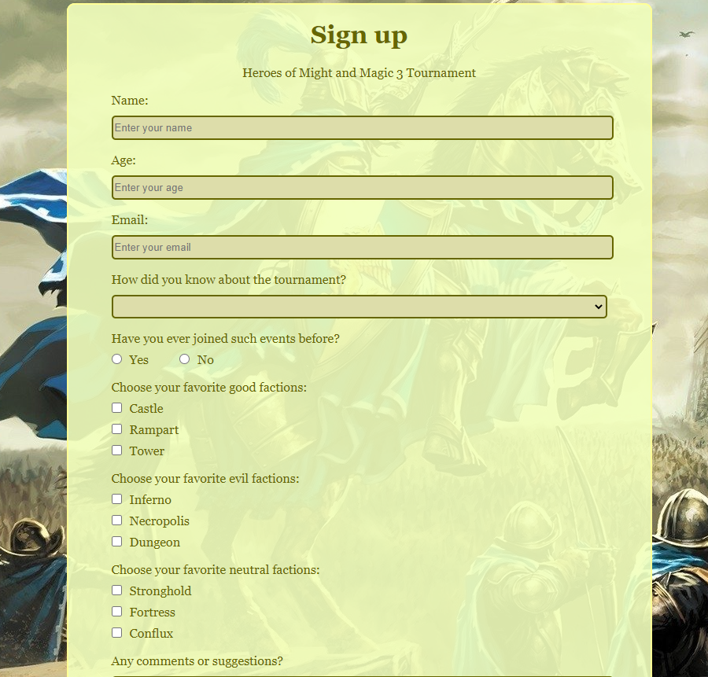
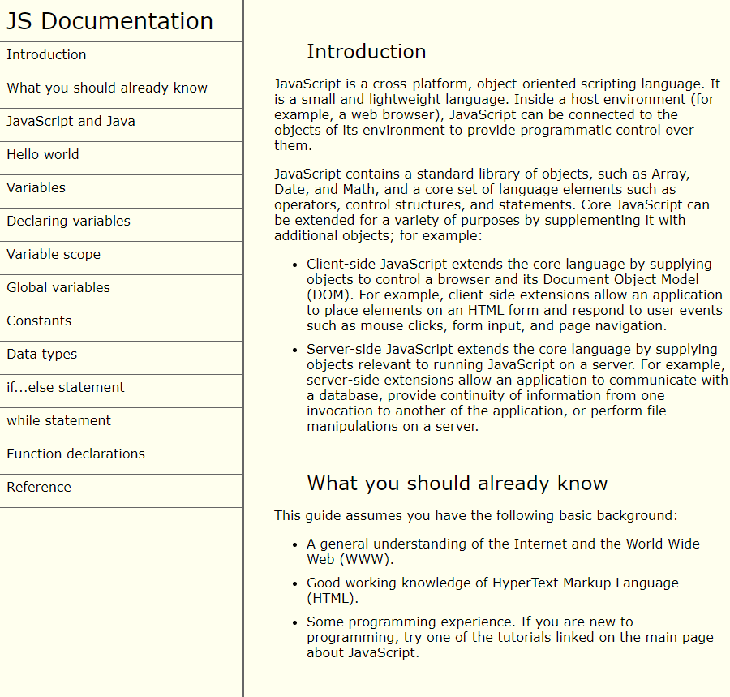

<!DOCTYPE html>
<html lang="en">
<head>
	<meta charset="UTF-8">
	<title>Document</title>
	<link rel="stylesheet" href="style.css">
</head>
<body>
	<nav id="navbar">		
			<a href="#welcome-section" class="navbar-items">
About
</a>
			<a href="#work" class="navbar-items">
Work
</a>
			<a href="#contact" class="navbar-items">
Contact
</a>
	</nav>
	<main>
		<section id="welcome-section">
			<header><h1> Hi, I am Aleksandr</h1></header>
			
a junior web developer

		</section>
		<section id="work">
			<header><h1>These are some of my projects</h1></header>
			<section id="projects">
				<a href="https://github.com/es0230/tributepage" class="project-tile">
					<figure>
						
						<figcaption>Tribute page</figcaption>
					</figure>
				</a>
				<a href="https://github.com/es0230/surveyform" class="project-tile">
					<figure>
						
						<figcaption>Survey form</figcaption>
					</figure>
				</a>
				<a href="https://github.com/es0230/productlandingpage" class="project-tile">
					<figure>
						
						<figcaption>Product landing page</figcaption>
					</figure>
				</a>
				<a href="https://github.com/es0230/techdoc" class="project-tile">
					<figure>
						
						<figcaption>Technical documentation</figcaption>
					</figure>
				</a>
			</section>
		</section>
		<section id="contact">
			<header><h1>I wanna get some experience</h1></header>
			
Let's work together

			<a href="https://vk.com/id64778110">VK</a>
			<a href="mailto:caneyok@gmail.com">Email</a>
			<a href="https://github.com/es0230" target="_blank" id="profile-link">GitHub</a>
		</section>
	</main>
</body>
</html>